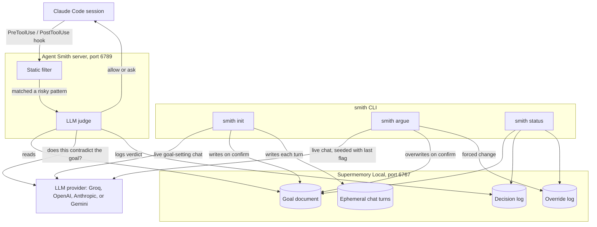

# Agent Smith

[](https://nodejs.org/)
[](https://claude.com/claude-code)
[](https://supermemory.ai)
[](https://expressjs.com/)


[](#license)

A goal-fidelity watchdog for AI coding agents. Tell it your project's goal once, and it watches Claude Code's tool calls, interrupting in character when you're about to quietly contradict yourself.

```
                        =%@@@@@@@@%                    
                   -%#=+=.:-::-*:-*=*@@=                ██████       ██████     ██████████   ██      ██   ██████████
               :++::.::...--:.::.--@@@..%@:           ██      ██   ██           ██           ████    ██       ██
             :=--::@@@%%%%@@@@@@@@@@-:%@@@==          ██████████   ██  ██████   ██████       ██  ██  ██       ██
            :::-+##..:::---::.........::.@@@=:        ██      ██   ██      ██   ██           ██    ████       ██
   :*=%@@@= -..:*%+=::----:.:----==-:-:::+@#:=        ██      ██     ██████     ██████████   ██      ██       ██
   =...:#@@*: ..=+*.-:--:---::::.:::.:-:--@=.+        
   +....::::+-..=*+-=--:=*+=:.:...:::..=#%@#@@        
   +.......:@@*@-#++@@@@@@@@@@@@@@@@@@@@@@@@+@          ████████   ██      ██   ██████████   ██████████   ██      ██
   +........@--*+#-+@...::..:%@=@@*..:.:::#@*@        ██           ████  ████       ██           ██       ██      ██
   :=:......-@=-@:+:.%@@@@@#=*%=+@%%@@@*:.:@@           ██████     ██  ██  ██       ██           ██       ██████████
   .+:......= +@.=::.:::.::-.*@@#%+.::::.-@*                  ██   ██      ██       ██           ██       ██      ██
    +:....-+   -@-=.::..::..=++=*%+.:.:-:@@           ████████     ██      ██   ██████████       ██       ██      ██
    =::....-:   @@%#:::::--=*##@*%%%%*.=@*            
    -:.......#@@@@@*@@+..-:-=++**++**=+@              Once a guardian of order within the Matrix. Now he
    =.:...+@@--@@+@@@@@@@@@:..-=+*+::#@@              watches over your code.
    -.....@*+.@@@#=:-----:=@@@*#**###@-@@*:           
   +.....@@+:*%#:.=-:.-::.:@@@@-:::@@@@@@.:+@*.       He remembers what you swore this project would be. For
  -#:+:.:@*:-=..:.:.:==:::@+:.@+-::@@--@%@....+%-     now, he only listens, but you never know when he will
 ..--...:@+:::=#--*%*-#*-:@=:.@@*..@@@.-@*-@@-.:-#    come for you.
 ....:-:..*+-..:::...--:-.@@.:..#@@-@@--:@*.%@=-.=    
 .::--:::..-+--::.:::-==.:*@::...::@@=@:.:@@:.@@-:    "Never send a human to do a machine's job."
 ...........:%@@#*---=:--:#@:.......:@@@=:.@@*.+@#    
 .............=@@@@+=.===+@@@@@-:.....:#@-:.-@@%:@
```

## How it works

`smith init` opens a live chat with Smith to pin down your project's goal. Give it a vague answer and it asks a clarifying question instead of accepting it blindly; tell it to just write something good and it drafts a concrete goal for you. Nothing is stored until you explicitly confirm it.

From then on, a local server checks risky Bash commands and file edits against that goal before Claude Code runs them. If an action looks like it contradicts what you said you wanted (adding Redis to a "ship v1 fast, no over-engineering" project, for example), Claude Code shows you a permission prompt with Smith's reasoning attached. You always make the final call. Every decision is logged, and a running **Consistency Score** tracks how often you've kept to your own word.

If you think a flag is wrong, or your goal has genuinely changed, `smith argue` opens the same kind of chat scoped to that specific decision. Make your case: if Smith is convinced, it drafts an updated goal for you to confirm. You can also force a goal change through without convincing it, but that gets logged as an override and costs you on the Consistency Score, since pushing a change through unconvinced is itself a sign the original goal wasn't thought through.

## Architecture



Every ephemeral chat turn from `smith init` is written to Supermemory as it happens, purely so a crashed session can be recovered later. Once you confirm the goal, those turns are deleted and only the final goal document remains.

## Requirements

- Node.js >= 18
- [Claude Code](https://claude.com/claude-code)
- [Supermemory Local](https://supermemory.ai) running (`supermemory-server`)
- An API key for one LLM provider: Groq, OpenAI, Anthropic, or Gemini

## Install

This package isn't published to the npm registry yet. Install it locally from source:

```bash
git clone https://github.com/AnanthuNarashimman/agent-smith.git
cd agent-smith
npm install
npm pack
npm install -g ./agent-smith-0.1.0.tgz
```

This puts a global `smith` command on your PATH, backed by this checkout.

## Execution

1. **Start Supermemory Local first.** Agent Smith stores your goal and decision history in it, and every command below fails fast with a clear message if it isn't reachable at `http://localhost:6767`.

2. **Run `smith init` inside your project's repo.** This is a one-time setup wizard per project:
   - Confirms Supermemory Local is reachable.
   - Prompts for an LLM provider and API key the first time you ever run it anywhere (validates the key before saving), and reuses that config on every later project.
   - Merges the required `PreToolUse`/`PostToolUse` hooks into `.claude/settings.json`.
   - Installs the `/smith-score` skill into `.claude/skills/`.
   - Starts the Agent Smith server in the background on port 6789 (if it isn't already running).
   - Opens a live chat to work out your project's goal with you, and only stores it once you explicitly confirm.

   ```bash
   smith init
   ```

3. **Work normally in Claude Code.** Every risky Bash command or file edit is silently checked against your goal. Nothing changes for routine work; you'll only see Smith when an action looks like it contradicts what you said you wanted, and even then it's a normal permission prompt where you decide whether to proceed.

4. **Disagree with a flag, or want to change your goal? Run `smith argue`.** It opens with the most recently flagged action and lets you make your case. Convince Smith and it drafts an updated goal for you to confirm; force one through unconvinced and it still saves, but logs as an override against your score.

   ```bash
   smith argue
   ```

5. **Check your Consistency Score any time:**

   ```bash
   smith status
   ```

   Or from inside Claude Code, run `/smith-score` for the same information, summarized conversationally.

6. **When you're done:**

   ```bash
   smith off     # stops the background server
   smith reset   # wipes the goal and decision/override history for this project (asks for confirmation)
   ```

## Commands

| Command        | What it does                                                              |
| -------------- | -------------------------------------------------------------------------- |
| `smith init`   | One-time setup wizard: provider config, Claude Code hooks, skill, server, and a live chat to set your goal. |
| `smith argue`  | Opens a live chat to contest a flagged action or revise the goal, seeded with the most recent flag. |
| `smith status` | Prints the current Consistency Score and flagged decision history.         |
| `smith off`    | Stops the background Agent Smith server.                                   |
| `smith reset`  | Deletes this project's goal and full decision/override history. Requires typing the project name to confirm. |

Inside Claude Code, `/smith-score` shows the same status as `smith status`, with a short conversational summary.

## License

ISC
